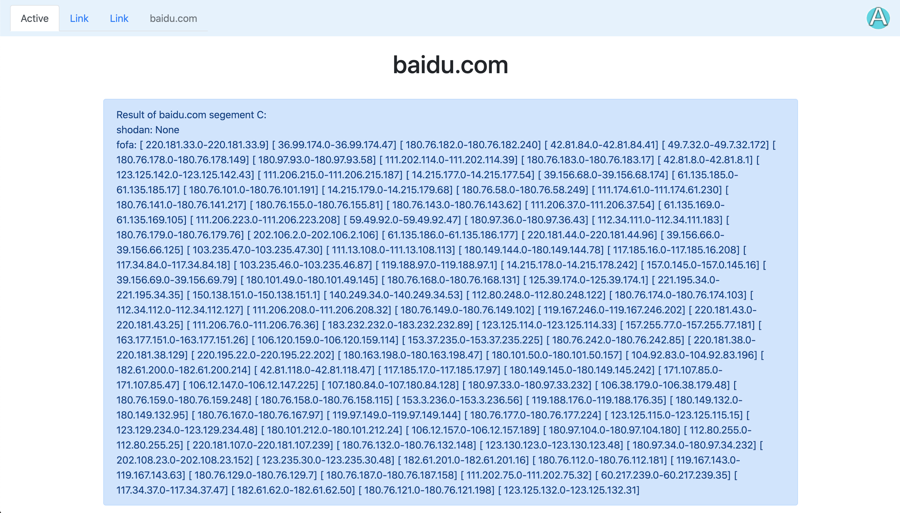
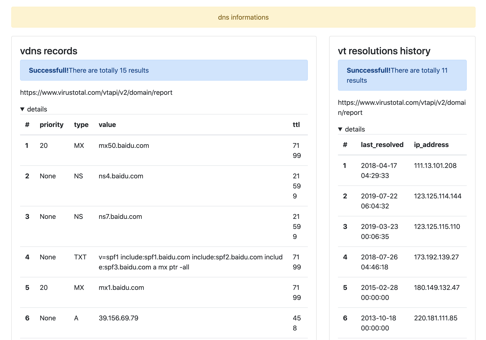
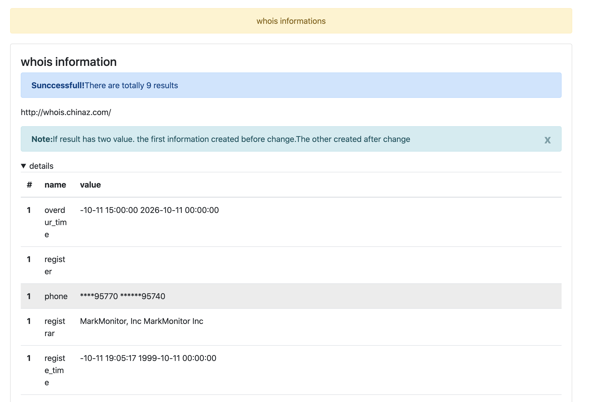
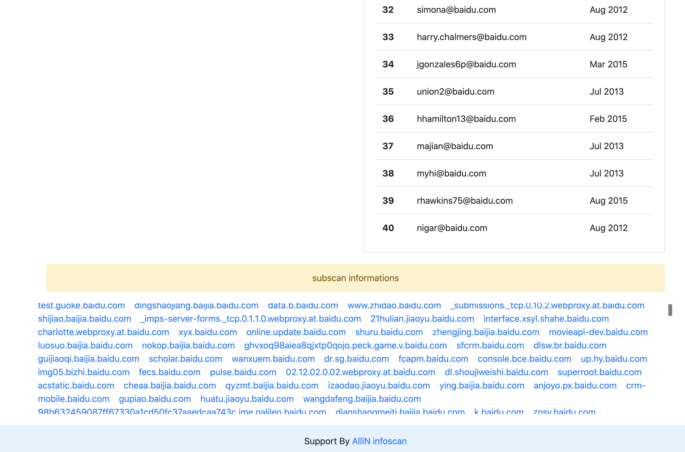

# ALLiN

[toc]


[](https://asciinema.org/a/8P9RwnYreRrLFlnS1fHok4Soo)

AlliN 一个辅助平常渗透测试项目或者攻防项目快速打点的综合工具，由之前写的工具AG3改名而来。是一款轻便、小巧、快速、全面的扫描工具。多用于渗透前资产收集和渗透后内网横向渗透。工具从项目上迭代了一些懒人功能（`比如提供扫描资产文件中，可以写绝大部分的各种形式的链接/CIDR,并在此基础上可以添加任意端口和路径`）


主要开发人员
- @Christasa
- @Cocoli
- @Like0x
- @MiluOWO

**用于非法用途与开发者无关。**

## Features

- python2.7 - python3.x 无依赖支持。
- 被动识别站点的一些架构信息，组件信息, 框架信息，指纹数量1000+。
- 被动识别访问站点是否是云上站点。
- 对导入资产扫描支持相对比较完善。几乎支持任意格式资产。


## 使用技巧

- pyinstaller 之后可以跨平台使用
- 建议在VPS上使用，也减少网络问题。
- 内网使用时，请将`Account`类中API账号置空


默认扫描会在当前目录以 --host 或者 --project 创建文件夹并保存文件, 默认不创建文件夹。

- res_alivedomain.txt  自动保存全部输出
- 文件夹内部
  - result.txt 普通扫描结果
  - focuson.txt 重点关注结果


如果你有很多扫描任务，可以使用以下脚本进行批量扫描

target.txt

```
xxx信息技术股份有限公司 xxx.com.cn
xxx网络技术有限公司 xxx.com
```

```bash

#!/bin/bash

while read line
do
    project=`echo $line | awk -F " " '{print $1}'`
    host=`echo $line | awk -F " " '{print $2}'`
    echo $host,$project
    python AlliN.py --host $host -q "(domain=\"$host\" || cert=\"$host\"  || title=\"$project\") &&  country=\"CN\" && region!=\"HK\" && region!=\"TW\" && region!=\"MO\"" -m sfscan --timeout 6 --project $project -t 100
done < target.txt
```


## 参数

### --host

指定ip，可以是单个ip也可以是多个ip

样例：

```
--host 10.1.1.1
--host 10.1.1.1-10.2.2.2
--host 10.1.1.1/24 # 任意CIDR
--host 10.1.1.1-255
--host 任意域名形式
```

### --timeout

timeout 请求超时时间，默认为3

```
--timeout 3
```

### --proxy

```
--proxy http://127.0.0.1:8081
--proxy socks5://127.0.0.1:1080
```

可以与Xray联动，但是线程需要设置为5，否则超过Xray最大队列数


### --project

给你的扫描项目起个名字，回创建一个文件夹在里面保存输出。

### -p

指定端口，可以是单个端口也可以是多个端口

样例：

```
-p 80
-p 80,443
-p 8000-9000
-p 80,8000-9000
-p- 全端口扫描
```

### -f 

指定文件内容，方式不局限于ip、url路径等等

样例：

`-f  iplist.txt`

这个文件里面的 target 形式可以以很多形式呈现 支持：


```python
http://www.baidu.com

1.1.1.1/24

www.baidu.com/asd

www.baidu.com:80/123

1.1.1.1/sads

1.1.1.1:8080/123

1.1.1.1-250

1.1.1.1-1.1.1.250
```

等 

全部混合在一起也可以识别，并且还可以和-p 参数混用


### -u

**需要配合 --host 或 -f**

每次请求，都会访问该host的指定路径。

样例：

```shell
python AlliN.py --host "10.0.0.1-10.0.0.2" -u '/login/index.jsp' -p 80
运行时会发出如下请求：
10.0.0.1/login/index.jsp
10.0.0.2/login/index.jsp

```


### -H

添加一个自定义header，目前只支持添加一个

样例：
```
python AlliN.py -f domain.txt -H "Cookie: xxxxx; UxxxxxxxN=Sxxxxp"
```

### --uf

和-u 参数功能一样，可添加成多个路径。

样例：

```python
python AlliN.py --host "10.0.0.1-10.0.0.2" -uf urlpath.list -p 80
urlpathlist 里面有 index.php 、index.jsp
访问方式为：
10.0.0.1/index.php => 10.0.0.1/index.jsp =>10.0.0.2/index.php => 10.0.0.2/index.jsp

```

### -t

指多线程数，默认为200

样例:

`-t 200`


### -o

将结果输出成文件。

目前输出的内容有：各种扫描器输出的结果

样例：

`-o answer.txt`


### --oJ

将结果以json格式输出。

样例：
`--oJ answer.json

`

### --nocert

关闭证书识别，可以减少一定的扫描时间

样例: 

`python AlliN.py --host 192.168.1.1/24 -p 443 --nocert`

普通输出的证书结果如下
```bash
[  https://1.1.1.1  | Server:Microsoft-HTTPAPI/2.0 |  400  | Size:334 |  Bad Request  | Certs URL: uat1.sandbox.operations.dynamics.cn | DigiCert Inc  ]
```

注意看 `Certs URL:  ` 字段，会把这个IP的https证书的域名部分 提取出来，这个功能的运用场景一般是内网，或者你有很多IP需要扫描，但不知道是不是目标企业的。


### --nobar

关掉进度条,适用于webshell管理器使用;

`python AlliN.py --host 192.168.1.1/24 --nobar`


### --hidden

--hidden 用于过滤相关状态码的响应。

目前支持：400,401,403,404,500,502.503,501

当然还可以支持更多，只需要你自己改加一下代码就好了，因为使用原生urllib 实现里面有很多坑，别问我为什么为这样。

样例：

`--hidden 404,400`


### --hiddensize

用于过滤响应包的长度

样例：

`--hiddensize 27,5367`  # 过滤长度为27、5367的数据包

返回结果中有一个字段是 Size ，告诉你返回包大小。


### --dd

head方式进行扫描探测

```python
python AlliN.py --host 192.168.1.1/24 -p 443 --dd
```


### --fs

Size of each result number of fofa scan

用于设置fofa 请求size 大小设置，最大为1w，默认情况下 超过1w需要花钱的。这个选项一般也不会用。

### -m

如果不加-m 参数，默认以tscan方式进行。

目前不能同时执行多种扫描方法。


#### oxid

用于获取远程主机网卡地址；

`python AlliN.py -m oxid --host 192.168.129.130`

根据135端口通信实现。

```python
[*] 127.0.0.1
        [->]hecs-xxxx0622130100
        [->]192.168.0.57
        [->]2001xxxxf57:ffc6
{'127.0.0.1': ['hxx-x-medixx-2-win-2020xxxx', '192.168.0.57', '2001xxxx3f57:ffc6']}
```


#### bakscan

扫后台，类似于御剑; 默认自带了一些备份文件，当然也可以用`-f`参数添加一些字典

`python AlliN.py --host 192.168.1.1/24 -p 443 -m bakscan`

`python AlliN.py --host 192.168.1.1/24 -p 443 -m bakscan -f dic.txt`

当然可以用head方式进行扫描探测；

`python AlliN.py --host 192.168.1.1/24 -p 443 -m bakscan --dd`


#### sfscan(舒服scan，noxxx起的名字)

subscan 与 fofascan 的结合体

`python AlliN.py -q 'domain="xx.com"' --host xxx.com -m sfscan`


增强用法，比如你同时想要扫描多个子域名

`python AlliN.py -q 'domain="xx.com"' --host xxx.com,yyy.com -m sfscan`

使用逗号分隔你的域名即可。


#### ddscan

这个名字乱起的，不用在乎它的含义。

子域名fuzz扫描；

扫描的位置取决于[fuzz]的位置;

参数：--dd  使用head请求方法进行扫描.  

样例

```shell
python AlliN.py --host "www.[fuzz]baidu.top" -f test.txt  -m ddscan
python AlliN.py --host "[fuzz].baidu.top" -f test.txt  -m ddscan
python AlliN.py --host "[fuzz].baidu.top" -f test.txt  -m ddscan --dd
```


#### hostscan

主要用于这种模式, fuzz  host头部

```http
GET /xxx.html HTTP/1.1
Host: [fuzz].baidu.com
Accept-Encoding: gzip, deflate
Accept: */*
Accept-Language: en
User-Agent: Mozilla/5.0 (Windows NT 10.0; Win64; x64) AppleWebKit/537.36 (KHTML, like Gecko) Chrome/86.0.4240.183 Safari/537.36
Connection: close

```

```
python AlliN.py -m hostscan --host https://1.1.1.1 --domain baidu.com -f dic.txt --nocert --project xx
```


#### infoscan

查询各种信息，目前有：

1. DNS记录(vt)
2. DNS对应IP解析历史（vt)
3. whois信息
4. cnnic信息（ip运营商信息）
5. shodan 收集的相关ip（按C段分类）
6. fofa 收集的相关ip（按C段分类）
7. 检查ip是否为阿里云服务器（or 腾讯云服务器）

样例

```shell
python AlliN.py --host "baidu.com" -m infoscan 
```


```

            _____       ________
            ___(_)_________  __/________________________ _______
            __  /__  __ \_  /_ _  __ \_  ___/  ___/  __ `/_  __ \
            _  / _  / / /  __/ / /_/ /(__  )/ /__ / /_/ /_  / / /
            /_/  /_/ /_//_/    \____//____/ \___/ \__,_/ /_/ /_/


Type "help" for more information.
infoscan>help

Choose the scan modules:
[*]SEGE		get C of segement

[*]DNS\1		vdns records scan
[*]DNS\2		vt resolutions history

[*]WHOIS\1		whois information
[*]WHOIS\2		cnnic information
[*]WHOIS\3		email information
[*]WHOIS\4		riskiq information

[*]SUBDOMAIN		subscan information
[*]ALLSCAN		all scan

Example: DNS\1\2 WHOIS\2\3
infoscan>ALLSCAN
 [+]  segement C require successfull
 [+]  vdns records require successfull
 [+]  vt resolutions require successfull
 [+]  whois  require successfull
 [+]  cnnic information  require successfull
 [+]  email search require successfull
 [+]  riskiq search require successfull
 [+]  subdomain require successfull
```


因为有用到外链 JS 和CSS 可能加载有点慢。










#### fscan

指利用fofa扫描。

```
-q 输入查询语法，查询语法参考fofa搜索规则。
--fs 指fofa搜索记录，默认10000条
```

样例：

`python AlliN.py -q domain="baidu.com" -m fscan --fs 200`

#### pscan

指端口扫描

-p 指定端口
全端口使用参数`-p-`

样例：

`python AlliN.py --host 10.1.1.1/24 -p 80 -m pscan`


#### tscan

标题扫描，如果只要tscan不需要加任何参数

样例：

`python AlliN.py --host 10.1.1.1/24 -p 80`


#### 17scan

MS17-010漏洞扫描

样例：

`python AlliN.py --host 10.1.1.1/24 -m 17scan`


#### dpscan

DOUBLEPULSAR backdoor check

样例:
`python AlliN.py --host 10.1.1.1/24 -m dpscan --verbose`


#### nbscan

nbtscan

样例:

`python AlliN.py --host 10.1.1.1/24 -m nbscan`


#### subscan

子域名扫描，调用riskq接口

样例：

`python AlliN.py --host "xx.com" -m subscan`


#### sscan

tscan-安全版本，去掉了tscan自动识别shiro的功能。

样例:

`python AlliN.py --host 10.1.1.1/24 -p 80 -m sscan`


#### uncd

一个用于解码的小模块。

内置: powershell encode 、bash encode 、 F5 decode. 默认以F5 decode方式执行。

样例：

`python AlliN.py -m uncd -e f5 -s 185903296.21520.0000`

```
-e f5 f5decode
-e pw powershell encode
-e bh bash encode
```


#### 0708scan

用于检测CVE-2018-0708漏洞是否存在。

样例：

`python AlliN.py --host 192.168.1.1/24 -m 0708scan -p 3389`

多线程模式下，可能会不准，后面优化一下。


#### ICMPT

用于内网穿透;.

条件是内网主机开启 **icmp Ping**

开启步骤分两步： vps端（server）与客户端(client)

第一步： 在自己的vps上，输入 `python AlliN.py -m icmpt `

第二步： 在客户端上，输入 `python AlliN.py -m icmpt --sip vps --cip 127.0.0.1 --cport 80` 。 这一步的意思是转发client的80端口流量。

运行完第二步后，你的vps上输出内容：

```
Accpet new client from : 14178 192.168.148.1
Your server port is :33127
```

此时你访问vps:33127 就是client上80的内容辣


样例：

```
python AlliN.py -m icmpt --sip vps --cip 127.0.0.1 --cport 80

Then you can browse vps_ip:36267 to access target_ip:target_port


```

#### cdnscan

使用场景: 大量IP需要确认是否为CDN节点时。

```
python3 AlliN_pro.py -f AllIP.txt -m cdnscan
```

后续也会直接在正常输出中显示。


> 部分代码为现有一些github项目整合而来。由于抄了比较多的项目这边就不一一写上了，在此谢过。

